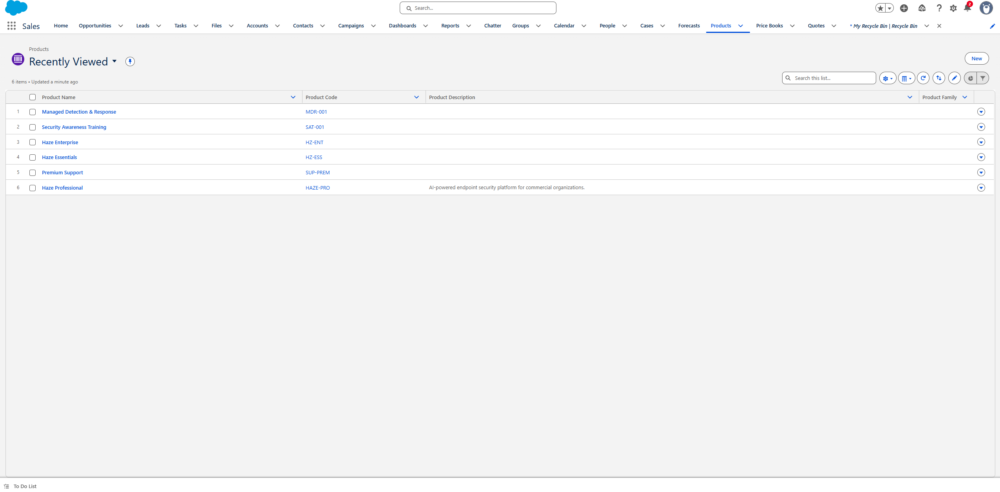

# Product Catalog

## Business Objective

Create a standardized product catalog for CloudShield Security so sales representatives can quickly build Opportunities and Quotes using approved products and pricing.

---

## Salesforce Objects Used

- Product
- Price Book
- Opportunity Product
- Quote Line Item

---

## Products Created

| Product | Product Code | Purpose |
|----------|--------------|---------|
| Haze Essentials | HZ-ESS | Entry-level endpoint security |
| Haze Professional | HAZE-PRO | Commercial endpoint protection |
| Haze Enterprise | HZ-ENT | Enterprise-grade cybersecurity platform |
| Premium Support | SUP-PREM | Priority support and faster SLAs |
| Managed Detection & Response | MDR-001 | 24/7 threat monitoring |
| Security Awareness Training | SAT-001 | Employee cybersecurity training |

---

## Screenshot

---

## Business Value

A standardized product catalog ensures that sales representatives quote the correct products with consistent pricing while reducing errors during the sales process.

---

## What I Learned

- Products are reusable Salesforce records.
- Products can be added to Opportunities and Quotes.
- A centralized product catalog improves consistency across the sales team.

---

## Skills Demonstrated

- Salesforce Product Management
- SaaS Product Catalog Design
- Opportunity Products
- Quote Preparation

---

## Interview Talking Point

> I created a reusable SaaS product catalog in Salesforce that supported opportunity management, quoting, and future renewal opportunities.