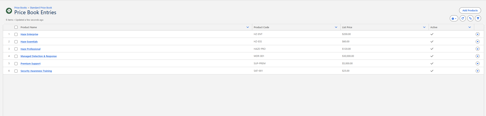
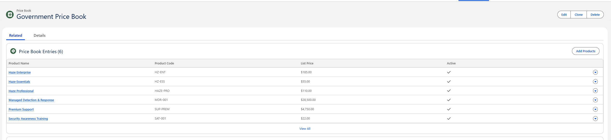

# Price Books

## Objective

Configure multiple Salesforce price books to support different customer pricing strategies while maintaining a centralized product catalog.

---

## Salesforce Objects Used

- Products
- Price Books
- Price Book Entries
- Opportunities

---

## Price Books Created

CloudShield Security uses two price books to support different customer segments.

### Standard Price Book

The Standard Price Book contains the default commercial pricing for all CloudShield Security products.

### Government Price Book

The Government Price Book contains pricing intended for government customers while using the same product catalog.

---

## Product Pricing

| Product | Standard | Government |
|---------|---------:|-----------:|
| Haze Essentials | $60/user/year | $55/user/year |
| Haze Professional | $120/user/year | $110/user/year |
| Haze Enterprise | $200/user/year | $185/user/year |
| Premium Support | $5,000/year | $4,750/year |
| Managed Detection & Response | $30,000/year | $28,500/year |
| Security Awareness Training | $25/user/year | $22/user/year |

---

## Sales Process

When creating an opportunity, the sales representative selects the appropriate price book based on the customer.

This ensures:

- Approved pricing is used.
- Products are consistent across all sales opportunities.
- Different customer segments can receive different pricing without duplicating products.

---

## Business Value

Using multiple price books allows CloudShield Security to support commercial and government customers while maintaining one centralized product catalog.

This approach reduces pricing errors, simplifies product management, and improves quote consistency.

---

## Key Takeaways

- Products can exist in multiple price books.
- Each price book can assign different prices to the same product.
- Opportunities use one price book at a time.
- Separate price books support different customer pricing strategies.

---

## Skills Demonstrated

- Salesforce Product Management
- Price Book Configuration
- Price Book Entries
- Customer Pricing Strategies
- Opportunity Preparation

---

## Interview Talking Point

> I created separate Standard and Government price books to demonstrate how Salesforce can support multiple customer segments while maintaining a single product catalog.